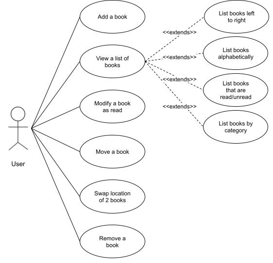
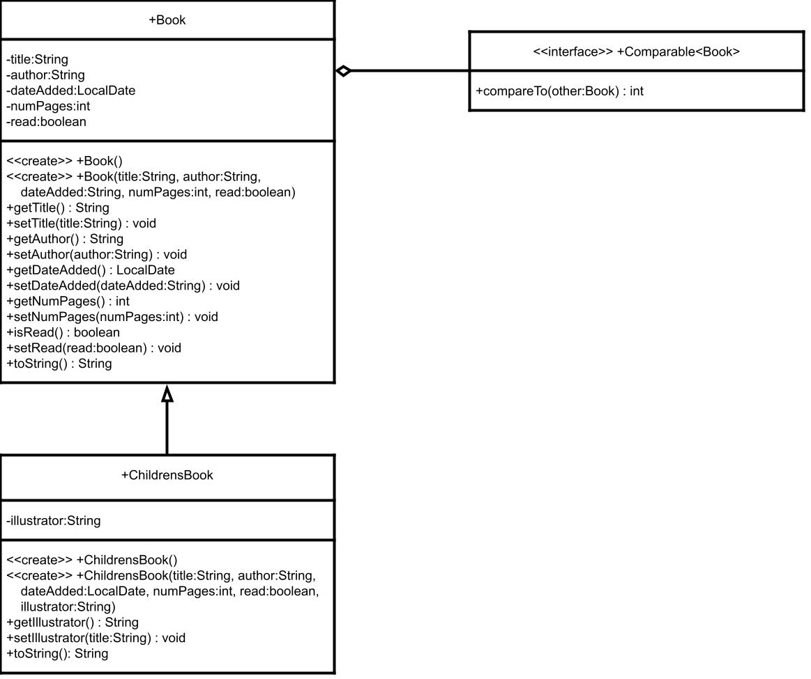

## About the project

XXXX. Tell the employer what the task was. What you learned? What struggles you had?

## Use Cases

As a user, I want to:

- add books to a bookshelf.
- view a list of books on the bookshelf (in order left to right, alphabetically, read/unread, by category).
- modify a book as read
- move a book to a specific location on the bookshelf.
- swap the position of books on the bookshelf.
- remove a book from the bookshelf.

## Class Diagram

